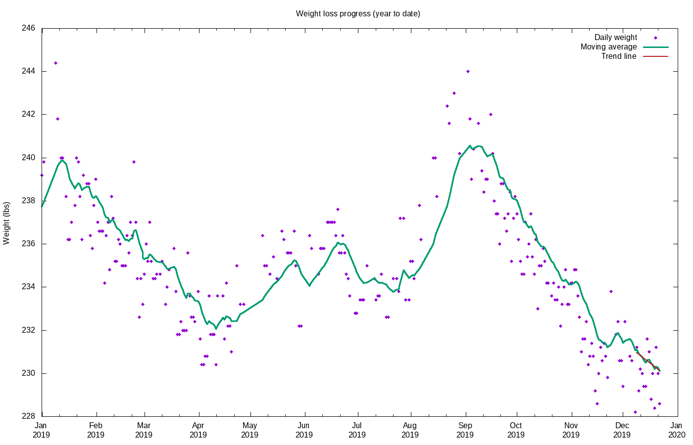
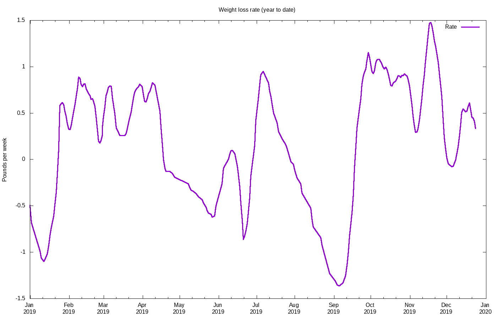

# Weight loss progress

Calculating trend using 12 data points, 2019-12-05 to 2019-12-17

## Stats

Stat|Value
:-|:-
**Goal**|215.00 lbs on 2020-04-01
**Current weight**|230.46 lbs
**BMI**|28.65
**Lost so far**|52.54 lbs = 18.57% of starting weight
**Remaining**|15.46 lbs =  6.71% of current  weight
**Progress**|77.27%
**Required rate**|1.02 lbs / wk
**Actual rate**|0.64 lbs / wk = 0.28% per week  (r2 = 0.90)
**Deficit**|318 kcal / day
**Energy burned**|183892 kcal
**Goal reached**|2020-06-03 (63 days late)
**Days done**|667
**Days remaining**|169

## Projections

Date|Projected weight|Loss
:-|:-|:-
**2019-12-31**|229.19|53.81
**2020-04-01**|220.82|62.18
**2020-06-20**|213.54|69.46
**2020-12-31**|195.89|87.11

## Graphs

