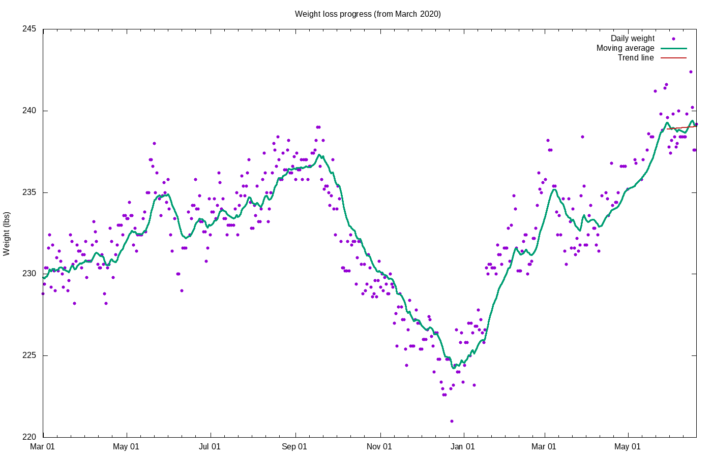

# Weight loss progress

Calculating trend using 15 data points, 2021-04-07 to 2021-04-28

## Stats

Stat|Value
:-|:-
**Goal**|210.00 lbs on 2021-12-31
**Current weight**|234.87 lbs
**BMI**|29.20
**Lost so far**|48.13 lbs = 17.01% of starting weight
**Remaining**|24.87 lbs = 10.59% of current  weight
**Progress**|65.93%
**Required rate**|0.70 lbs / wk = 0.30% per week
**Actual rate**|-0.56 lbs / wk = -0.24% per week  (r2 = 0.89)
**Deficit**|-278 kcal / day
**Target adjust**|-631 kcal / day
**Total burned**|168448 kcal

Not losing weight &mdash; no projection available

## Graphs

