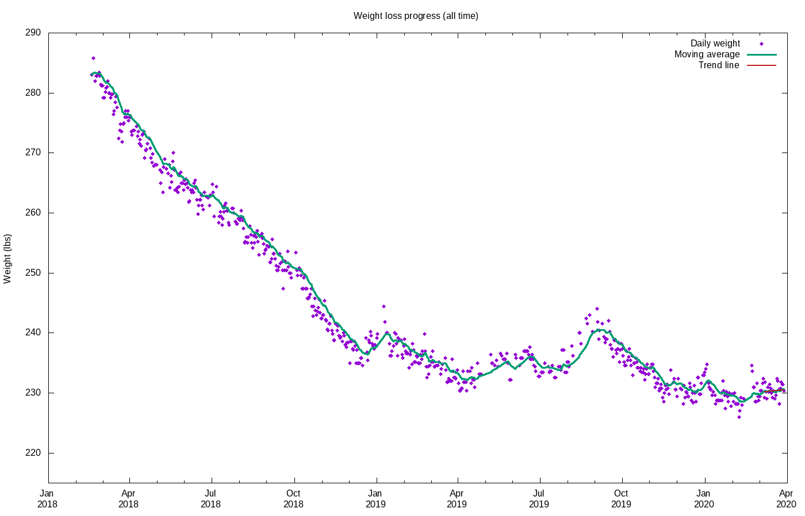
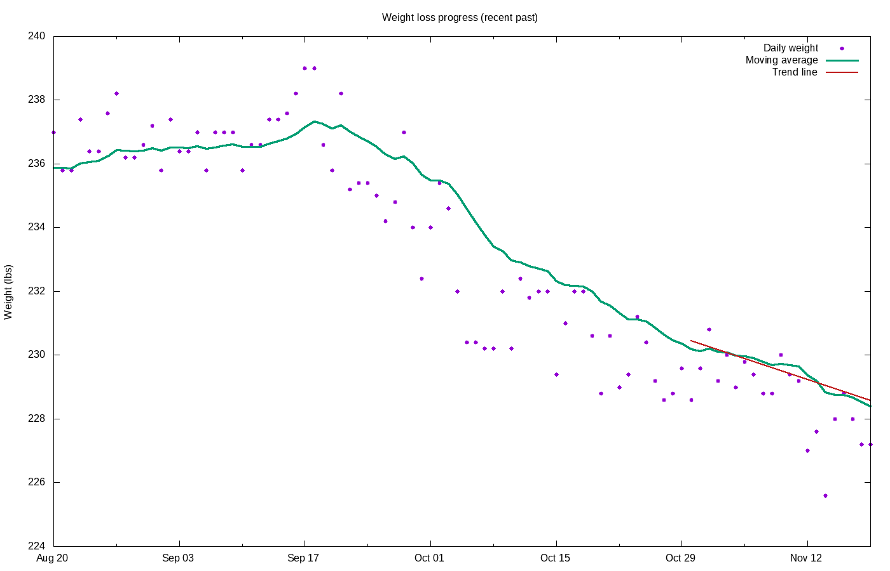
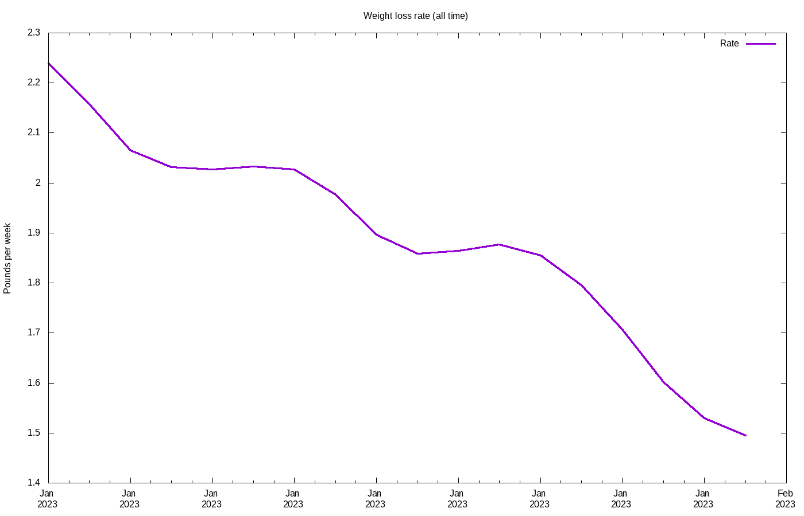
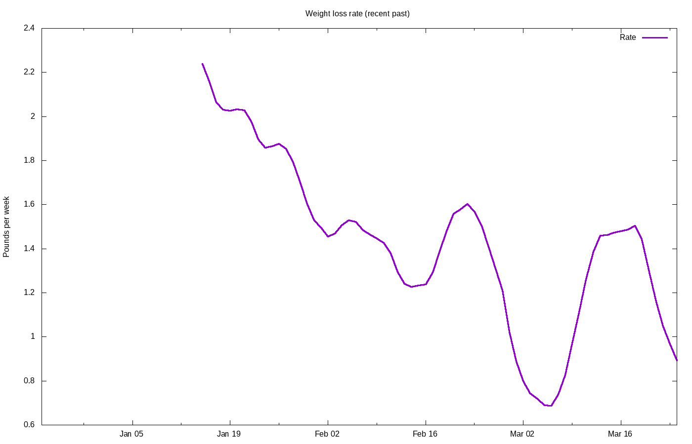

# Weight loss progress

Calculating trend using 20 data points, 2023-02-23 to 2023-03-15

## Stats

Stat|Value
:-|:-
**Goal**|240.00 lbs on 2023-12-31
**Current weight**|251.86 lbs
**BMI**|31.32
**Lost so far**|15.94 lbs =  5.95% of starting weight
**Remaining**|11.86 lbs =  4.71% of current  weight
**Progress**|57.34%
**Required rate**|0.29 lbs / wk = 0.11% per week
**Actual rate**|1.22 lbs / wk = 0.48% per week  (r2 = 0.96)
**Deficit**|610 kcal / day
**Target adjust**|467 kcal / day
**Total burned**|55787 kcal
**Goal reached**|2023-05-22 (223 days early)
**Days done**|74
**Days remaining**|68

## Projections

Date|Projected weight|Loss
:-|:-|:-
**2023-07-01**|233.03|34.77
**2023-12-31**|201.13|66.67

## Graphs

