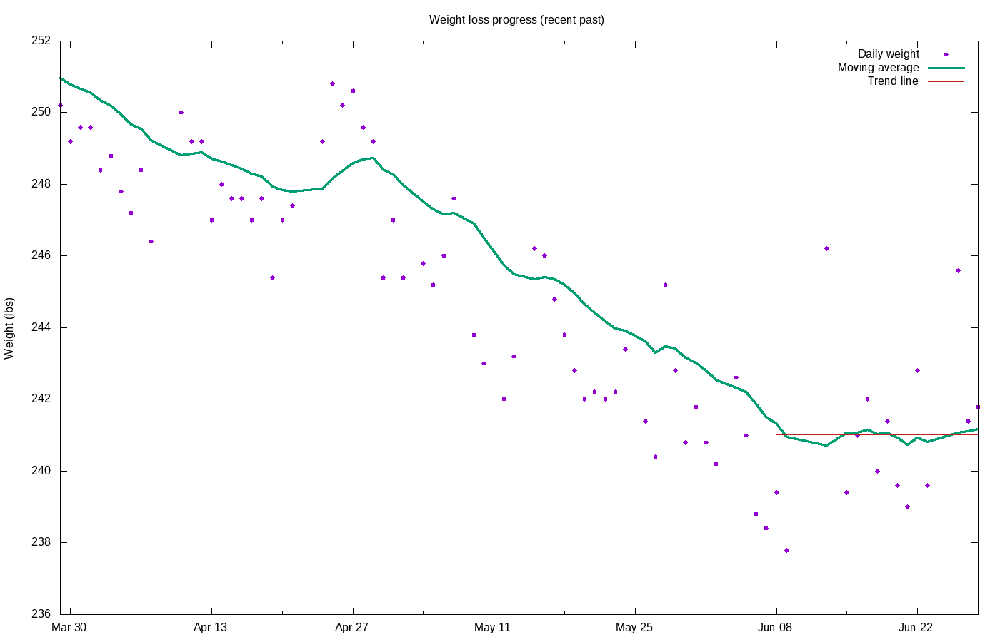

# Weight loss progress

Calculating trend using 21 data points, 2020-08-30 to 2020-09-19

## Stats

Stat|Value
:-|:-
**Goal**|215.00 lbs on 2020-12-31
**Current weight**|237.26 lbs
**BMI**|29.50
**Lost so far**|45.74 lbs = 16.16% of starting weight
**Remaining**|22.26 lbs =  9.38% of current  weight
**Progress**|67.27%
**Required rate**|1.51 lbs / wk
**Actual rate**|-0.25 lbs / wk = -0.11% per week  (r2 = 0.69)
**Deficit**|-127 kcal / day
**Energy burned**|160100 kcal

Not losing weight &mdash; no projection available

## Graphs

