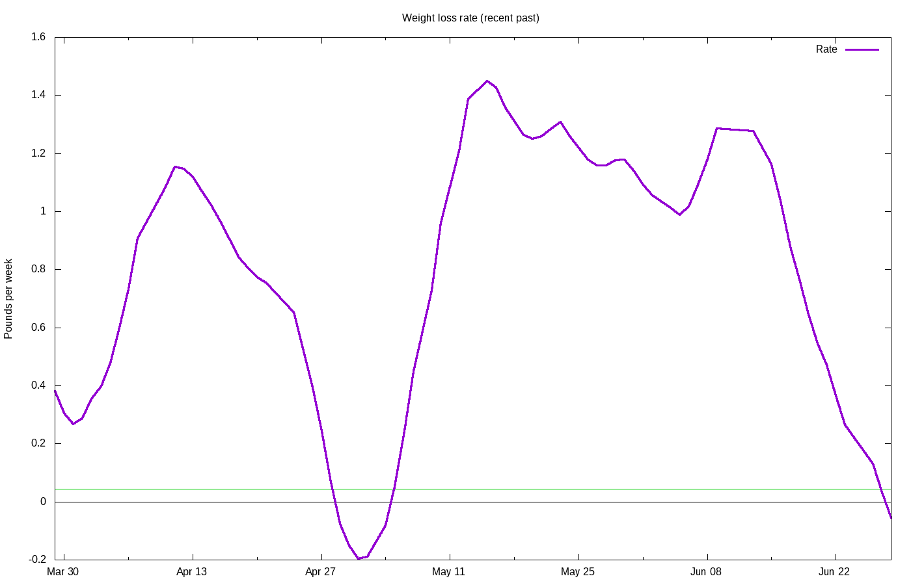

# Weight loss progress

Calculating trend using 21 data points, 2020-12-19 to 2021-01-08

## Stats

Stat|Value
:-|:-
**Goal**|225.00 lbs on 2021-12-31
**Current weight**|225.34 lbs
**BMI**|28.02
**Lost so far**|57.66 lbs = 20.38% of starting weight
**Remaining**|0.34 lbs =  0.15% of current  weight
**Progress**|99.42%
**Required rate**|0.01 lbs / wk = 0.00% per week
**Actual rate**|-0.12 lbs / wk = -0.05% per week  (r2 = 0.12)
**Deficit**|-60 kcal / day
**Target adjust**|-63 kcal / day
**Total burned**|201823 kcal

Not losing weight &mdash; no projection available

## Graphs

