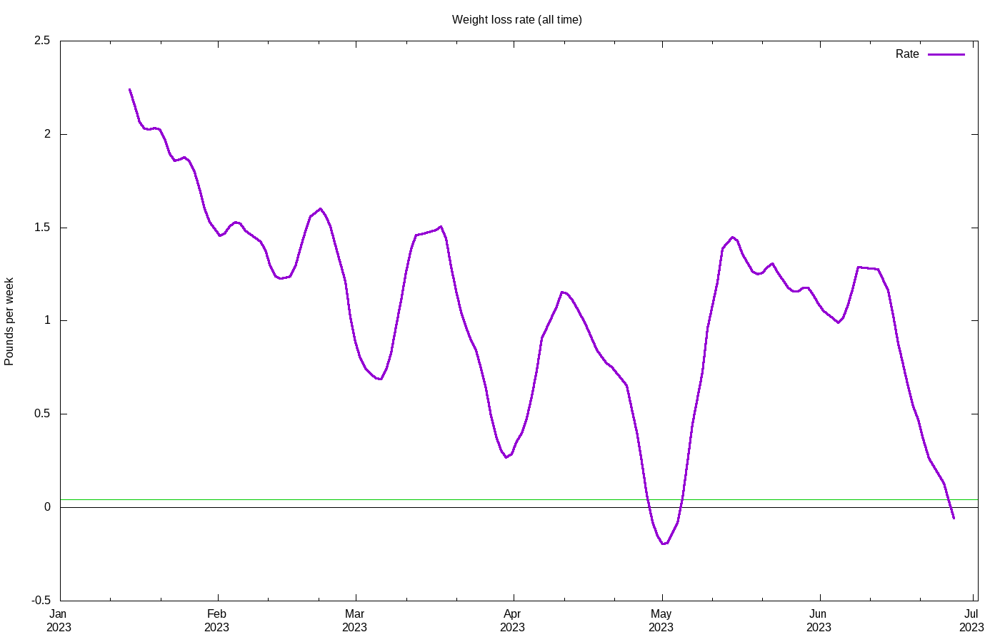

# Weight loss progress

Calculating trend using 21 data points, 2023-03-17 to 2023-04-06

## Stats

Stat|Value
:-|:-
**Goal**|240.00 lbs on 2023-12-31
**Current weight**|249.55 lbs
**BMI**|31.03
**Lost so far**|18.25 lbs =  6.82% of starting weight
**Remaining**|9.55 lbs =  3.83% of current  weight
**Progress**|65.65%
**Required rate**|0.25 lbs / wk = 0.10% per week
**Actual rate**|0.55 lbs / wk = 0.22% per week  (r2 = 0.84)
**Deficit**|276 kcal / day
**Target adjust**|151 kcal / day
**Total burned**|63881 kcal
**Goal reached**|2023-08-04 (149 days early)
**Days done**|96
**Days remaining**|120

## Projections

Date|Projected weight|Loss
:-|:-|:-
**2023-07-01**|242.76|25.04
**2023-12-31**|228.32|39.48

## Graphs

