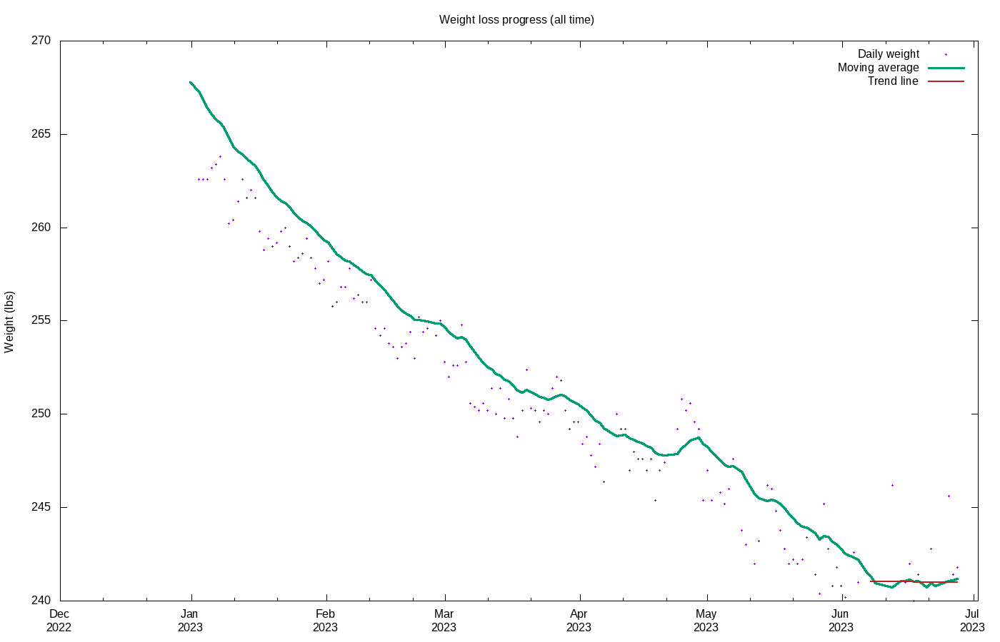

# Weight loss progress

Calculating trend using 14 data points, 2020-01-09 to 2020-01-23

## Stats

Stat|Value
:-|:-
**Goal**|215.00 lbs on 2020-12-31
**Current weight**|230.07 lbs
**BMI**|28.61
**Lost so far**|52.93 lbs = 18.70% of starting weight
**Remaining**|15.07 lbs =  6.55% of current  weight
**Progress**|77.84%
**Required rate**|0.31 lbs / wk
**Actual rate**|0.80 lbs / wk = 0.35% per week  (r2 = 0.83)
**Deficit**|400 kcal / day
**Energy burned**|185257 kcal
**Goal reached**|2020-06-02 (212 days early)
**Days done**|704
**Days remaining**|131

## Projections

Date|Projected weight|Loss
:-|:-|:-
**2020-06-20**|213.02|69.98
**2020-12-31**|190.82|92.18

## Graphs

