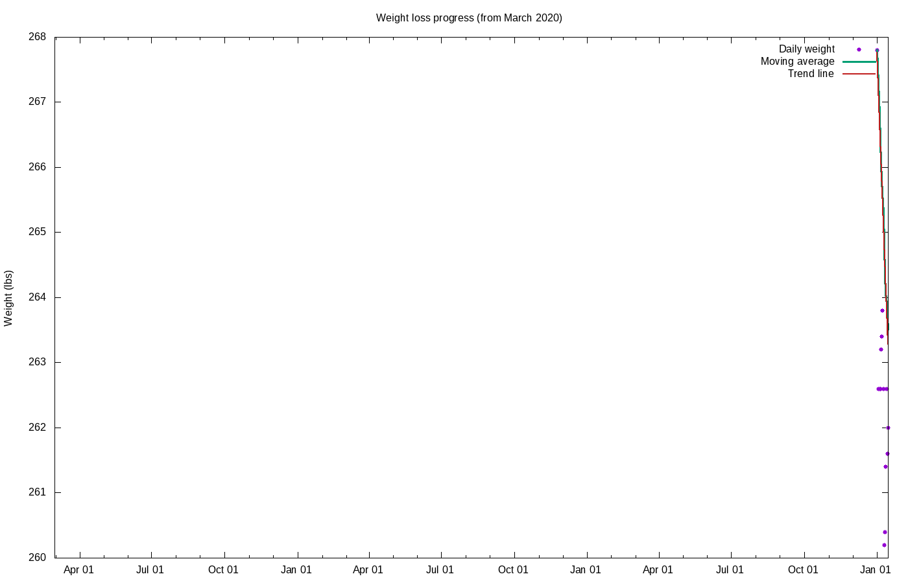

# Weight loss progress

Calculating trend using 21 data points, 2022-03-17 to 2022-04-06

## Stats

Stat|Value
:-|:-
**Goal**|230.00 lbs on 2022-06-01
**Current weight**|238.89 lbs
**BMI**|29.70
**Lost so far**|44.11 lbs = 15.59% of starting weight
**Remaining**|8.89 lbs =  3.72% of current  weight
**To past low**|14.66 lbs =  6.14% of current  weight
**Progress**|83.23%
**Required rate**|1.11 lbs / wk = 0.47% per week
**Actual rate**|0.57 lbs / wk = 0.24% per week  (r2 = 0.94)
**Deficit**|285 kcal / day
**Target adjust**|-270 kcal / day
**Total burned**|154387 kcal
**Goal reached**|2022-07-23 (52 days late)
**Days done**|1509
**Days remaining**|108

## Projections

Date|Projected weight|Loss
:-|:-|:-
**2022-06-01**|234.32|48.68
**2022-09-01**|226.82|56.18
**2022-12-31**|216.94|66.06

## Graphs

